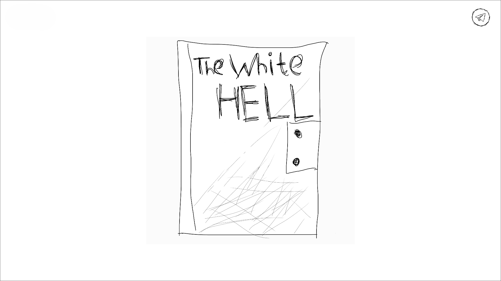
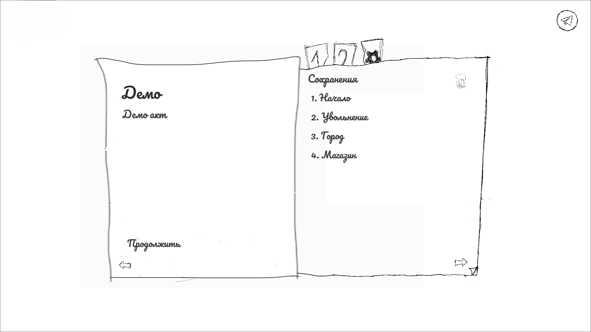
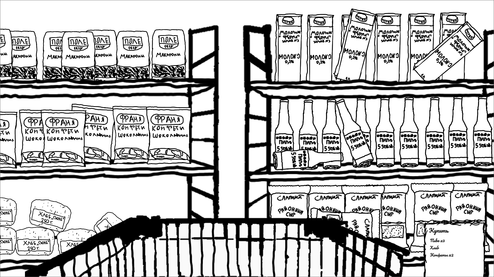
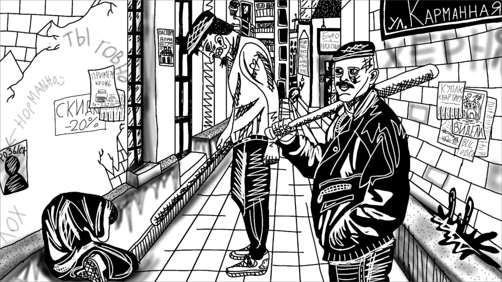
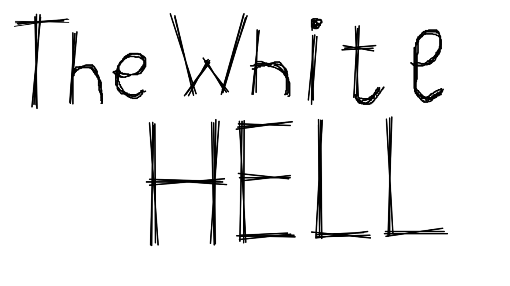

# ❄️ The White Hell — Demo (Open Source)  
_A Visual Novel in Black & White • Made with Godot_  
**by LavinLab**

## 🧊 About the Project  
**The White Hell** is a demo version of a minimalist visual novel exploring themes of isolation, memory, and cold. Presented entirely in black and white, it invites players into a stark, emotional landscape where every frame feels like a moment from an arthouse film.

Built with the **Godot Engine**, this open-source demo runs on:  
🖥️ **Windows** • 🐧 **Linux** • 📱 **Android** • 🌐 **Web**

## 🎮 Features  
- ✅ Fully open-source and beginner-friendly  
- ⚙️ Cross-platform builds  
- 🎨 Black & white visual style  
- 🧩 Simple project structure — great for learning Godot  
- 🌍 Easy to localize and modify

## 🖼️ Screenshots  
Here’s a glimpse into the world of *The White Hell*:

  
  
  
  


## 📦 Installation  
1. Clone the repository:  
   ```bash
   git clone https://github.com/your-repo/TheWhiteHellDemo.git
   ```
2. Open the project in Godot 3.x or 4.x
3. Export to your desired platform (Android, Web, Desktop)
4. Launch and explore the White Hell...
## 🧑‍💻 About LavinLab
We’re an indie studio of three passionate creators experimenting with visual novels, ethics, and aesthetics.

📧 Contact us: lavinlab@mail.ru
## 📜 License
This project is released under the MIT License.
Feel free to use, modify, and distribute it in accordance with the license terms.
